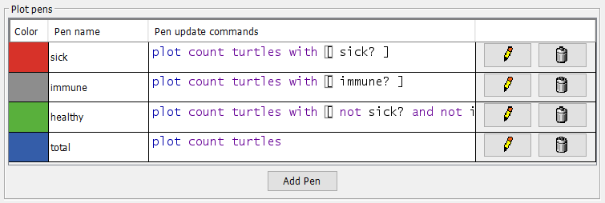
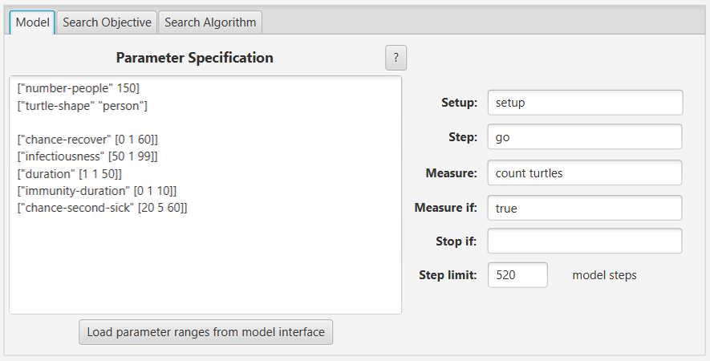
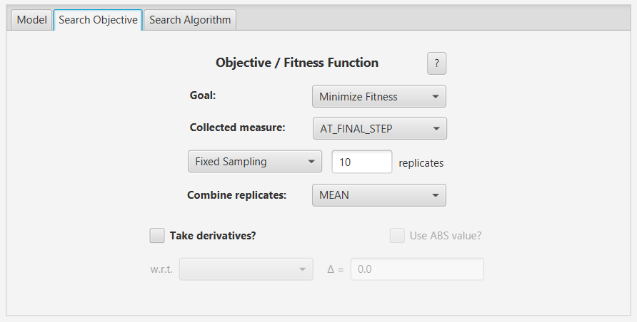
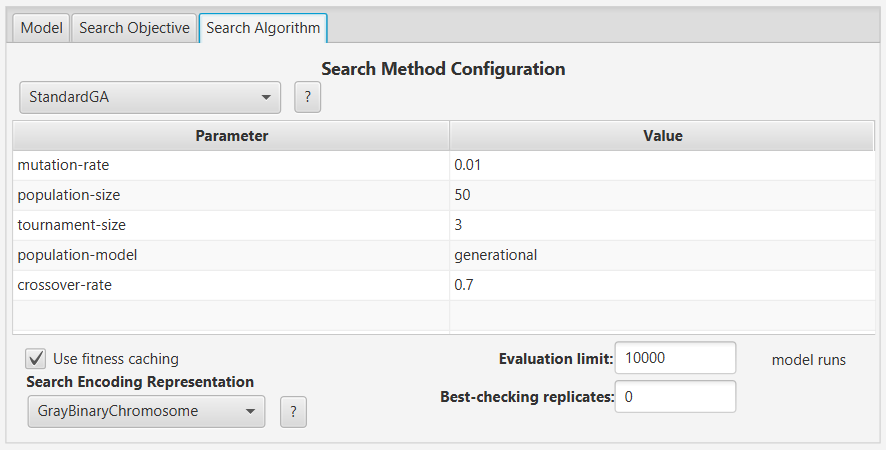
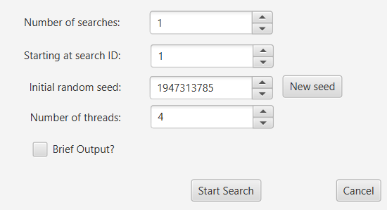
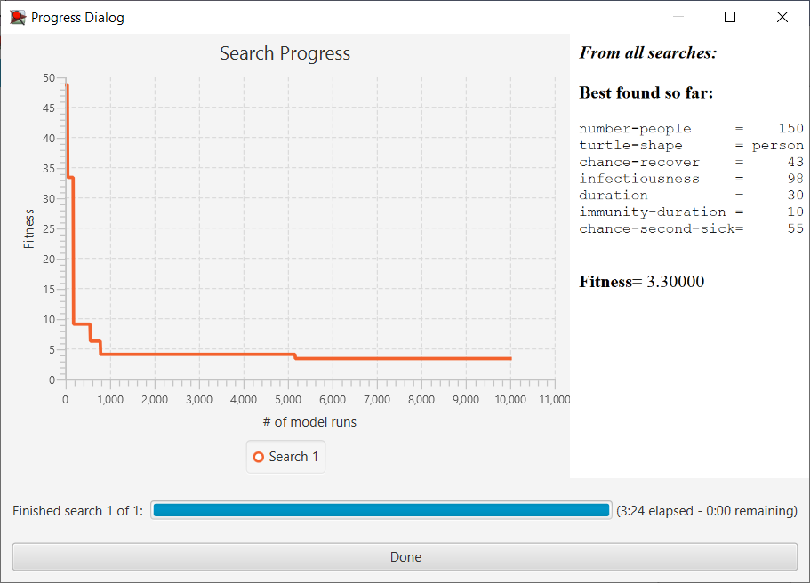
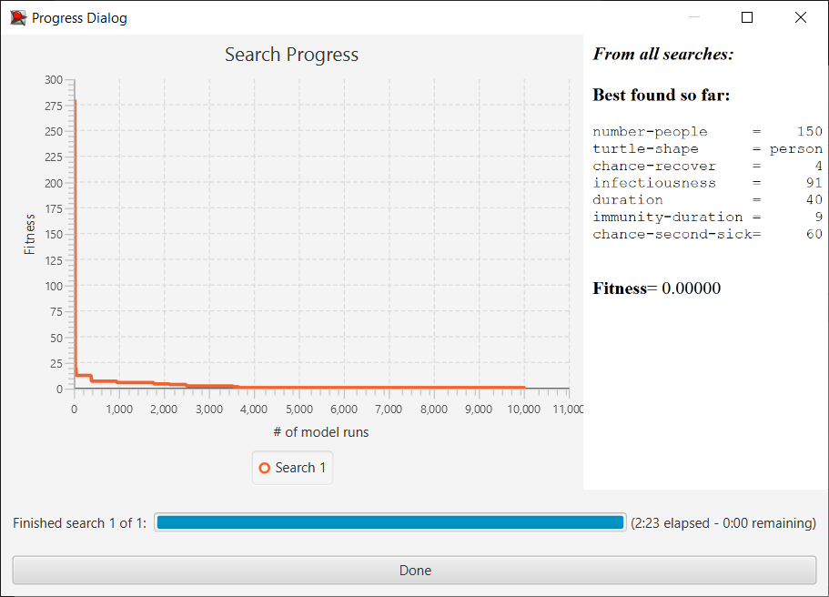
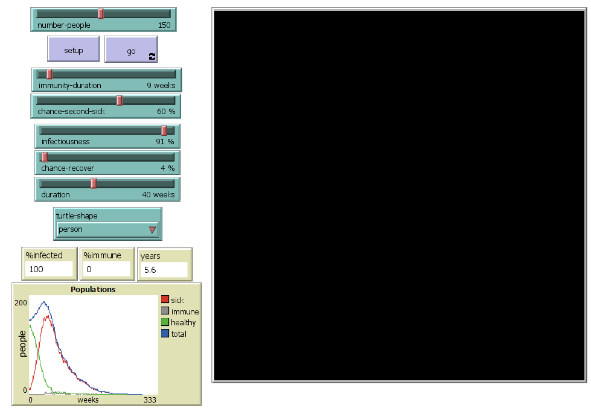

# Комп'ютерні системи імітаційного моделювання

СПм-22-6, Борисов Станіслав Олегович

Лабораторна робота №3. Використання засобів обчислювального интелекту для оптимізації імітаційних моделей

Варіант 3, модель у середовищі NetLogo: [Virus](https://www.netlogoweb.org/launch#https://www.netlogoweb.org/assets/modelslib/Sample%20Models/Biology/Virus.nlogo)

Вербальний опис обраної моделі знаходиться у [1 лабораторній роботі](Laboratory work 1/Laboratory_work_1.md#Вербальний-опис-моделі).

## Налаштування середовища BehaviorSearch

Параметри моделі (вкладка Model):

</br>["number-people" 150]
</br>["turtle-shape" "person"]

</br>["chance-recover" [0 1 60]]
</br>["infectiousness" [50 1 99]]
</br>["duration" [0 1 50]]
</br>["immunity-duration" [0 1 10]]
</br>["chance-second-sick" [20 5 60]]


Використовувана міра:
У якості цільової функції було обрано значення загальної кількості людей, вираз для його розрахунку взято з налаштувань графіка аналізованої імітаційної моделі в середовищі NetLogo 



та вказано у параметрі "Measure":

``` NetLogo
count turtles
```

Загальна кількість людей повинна враховуватись на останньому кроці. Тривалість симуляції для приклада, 520 тактів (10 внутрішніх років симуляції), починаючи з 0 такту симуляції.

Параметр *"Mesure if"* має значення *true*, хоча можна змінити на `ticks = 520`, бо нам цікаве останнє значення.

Параметр зупинки за умовою *"Stop if"* не використовувався.

Загальний вигляд вкладки налаштувань параметрів моделі:



## Налаштування цільової функції (вкладка Search Objective):

Метою підбору параметрів імітаційної моделі, що описує розповсюдження вірусу, є мінімізація загальної кількості людей – це вказано через параметр *"Goal"* зі значенням *Minimize Fitness*. Тобто необхідно визначити такі параметри налаштувань моделі, за яких через 10 внутрішніх років вірус знищить населення. При цьому цікавить останнє значення за всю симуляцію. Для цього у параметрі *"Collected measure"*, що визначає спосіб обліку значень обраного показника, вказано *AT_FINAL_STEP*.

Щоб уникнути викривлення результатів через випадкові значення, що використовуються в логіці самої імітаційної моделі, кожна симуляція повторюється по 10 разів, результуюче значення розраховується як середнє арифметичне.

Загальний вигляд вкладки налаштувань цільової функції:



## Налаштування алгоритму пошуку (вкладка Search Algorithm):

Загальний вид вкладки налаштувань алгоритму пошуку:



## Результати використання BehaviorSearch



Результат пошуку параметрів імітаційної моделі, використовуючи випадковий пошук:


Результат пошуку параметрів імітаційної моделі, використовуючи генетичний лгоритм:


Як можна бачити, генетичний алгоритм знайшов набір параметрів, що задовольняє цілі: зменшення популяції до 0. Через те, що модель має велику кількість керуючих параметрів, алгоритм випадкового пошуку, у загальному випадку, не буде ефективним через свою випадковість.

## Перевірка результатів


